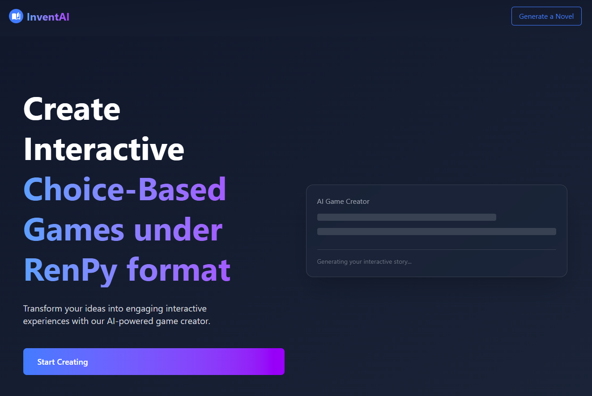
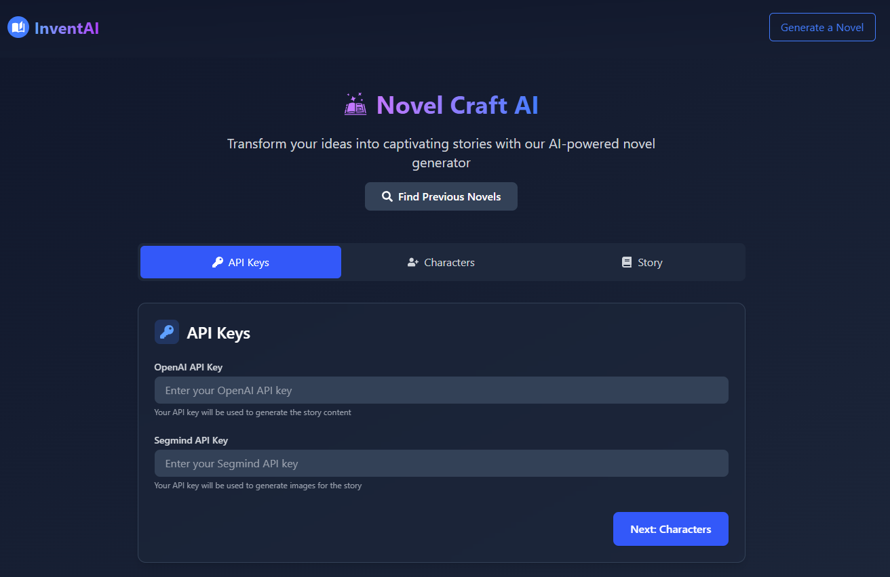
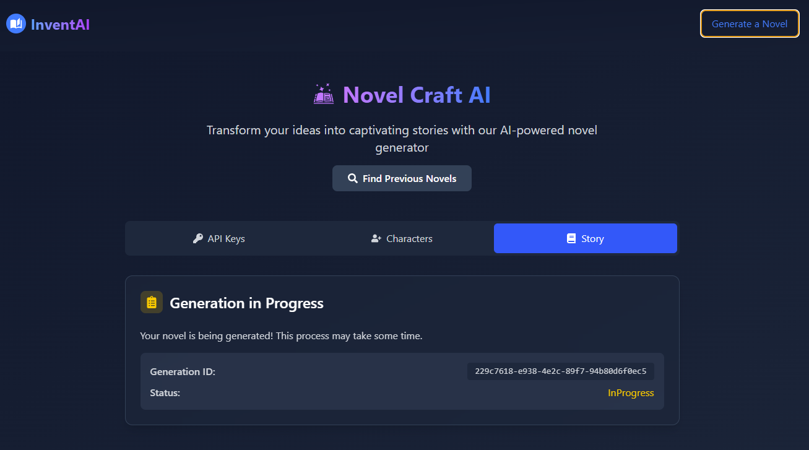
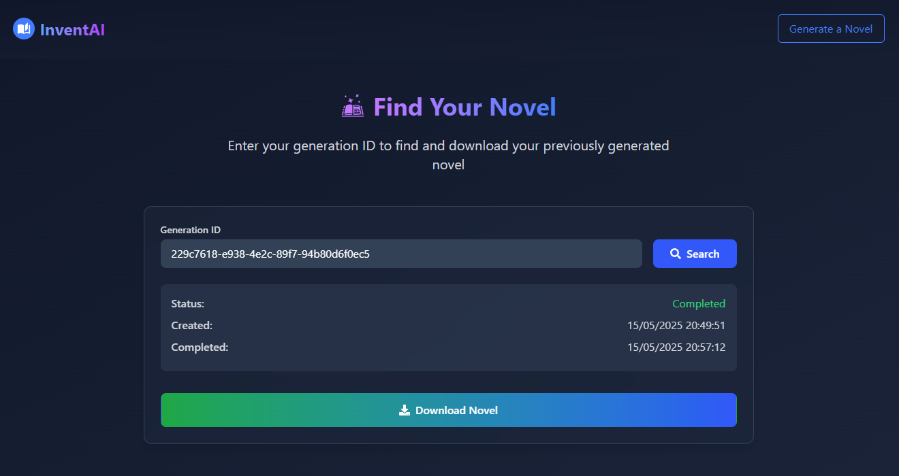
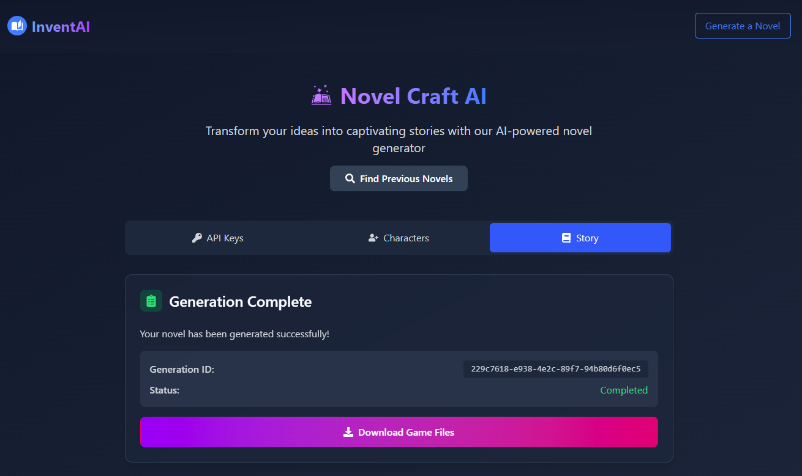

InventAI Novelcraft is a web-based tool for generating interactive novels and Ren'Py games using AI.

## Features

- Novel generation
- Character management
- Discussion context
- Export to Ren'Py

## Requirements
- Windows (64-bit)
- Linux (experimental)
- MacOS (experimental)

## Installation

To install and run the InventAI NovelCraft application, follow these steps:
1. **Download the latest release**: Go to the [latest release](https://github.com/InventaiSIL/novelcraft/releases) page and download the latest version of the application. The release will be in a `.zip` or `.tar.gz` format.
2. **Extract the files**: Unzip or untar the downloaded file to a directory of your choice.
3. **Launch the Server**: Open the `NovelCraft Server/web.Server.exe` file to start the server. This will launch the application and open it in your default web browser.
4. **Launch the Client**: Open the `NovelCraft Client.exe` file to start the client. This will open the client in your default web browser.

## Usage

Once the server and client are running, you can start generating novels and Ren'Py games.

1. **Creating a New Novel**: 
   - Click on the "Generate a Novel" button on the main page 
   - You will be prompted to enter your AI models credentials. Enter your OpenAI API key and Segmind API key for image generation 
   - You can then complete the form with the characters and the story setting.
   - Click on the "Generate" button to start generating your novel 
   - You will be given an identifier for your novel. You can use this identifier to access your novel later 

2. **Viewing Your Novel**:
   - Once the novel is generated, a button will appear on the main page with the identifier of your novel. Click on it to download the novel 
   - The novel will be downloaded as a `.zip` file containing two folders: `novel` and `renpy`. `renpy` contains the Ren'Py game files, and `novel` contains the generated novel files under a custom `InventAI` format.
   - You can view the novel in `Ren'Py` by opening the `renpy` folder in the [Ren'Py launcher](https://www.renpy.org/)